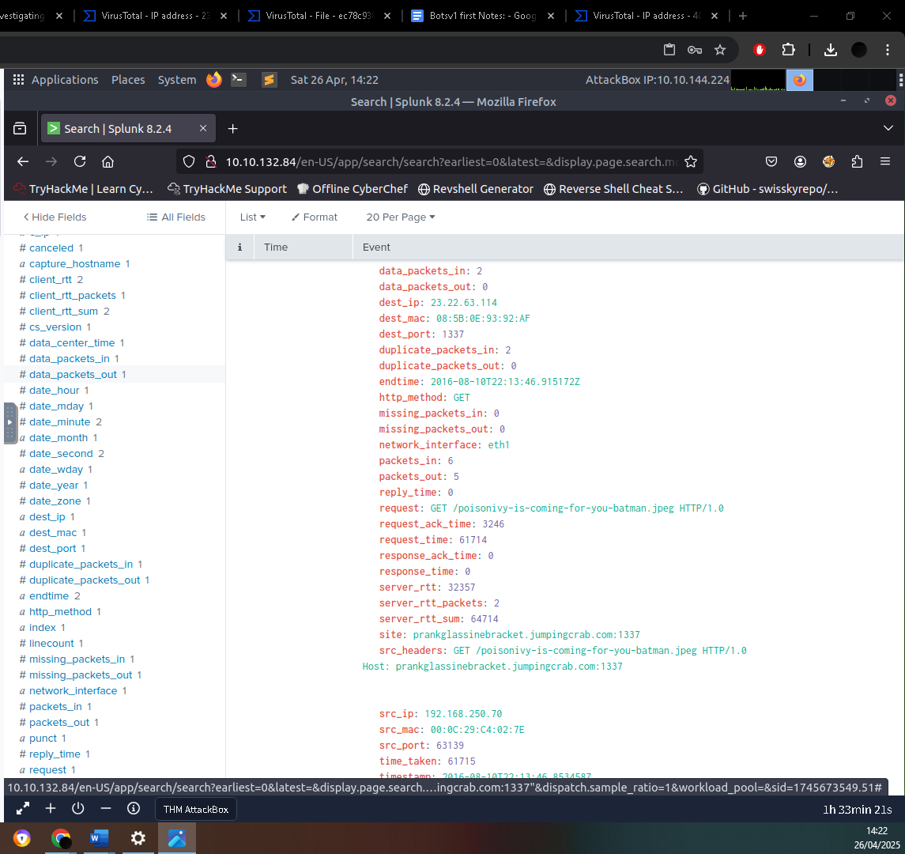
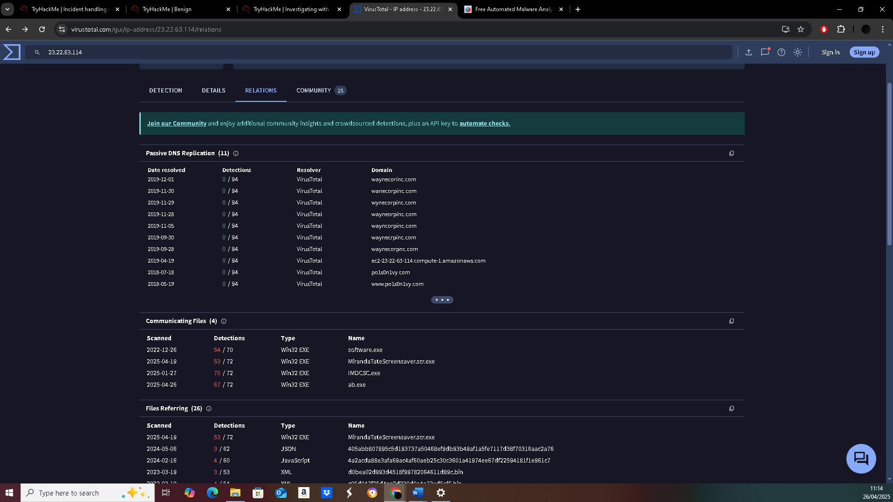
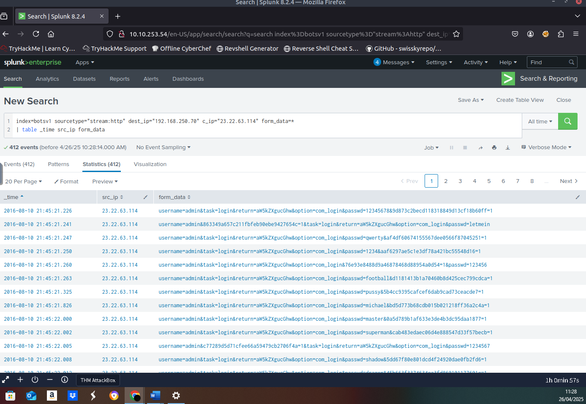
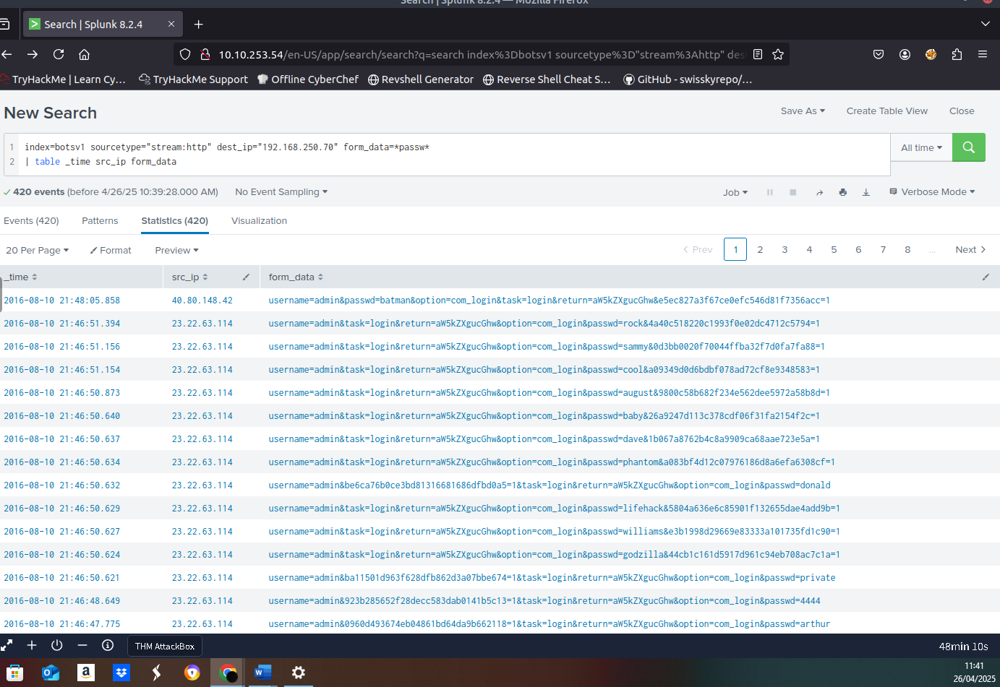

**Splunk Investigation Report: BOTS v1 Compromise Analysis**

---

### **Executive Summary**

This investigation reconstructed a multi-stage attack targeting a fictional organization. The attacker leveraged vulnerability scanning, web server defacement, brute-force attacks, malware deployment, and host compromise.

Using Splunk, Sysmon telemetry, and open-source intelligence (OSINT), I conducted a full incident investigation including threat detection, enrichment, IOC identification, attacker infrastructure mapping, and root cause analysis.

---

### **Detection & Initial Investigation**

#### **Vulnerability Scanner Detection**

Initial web traffic analysis revealed scanning behaviour. Investigation of the `stream:http` logs showed consistent HTTP requests with an unusual `user_agent` and `accept` field:

* **User-Agent**: Acunetix Web Vulnerability Scanner - Free Edition

* **Source IP**: 40.80.148.42

This indicated an external party conducting automated vulnerability assessments against the organization's infrastructure.

**Evidence**

#### **Target Identification**

Pivoting from the scanner traffic, I identified the web server under attack:

* **Target IP**: 192.168.250.70

* **Target Domain**: `imreallynotbatman.com`

The web server was later observed to engage in unusual outbound HTTP traffic, suggesting a potential compromise.

---

### **Incident Analysis: Web Server Defacement**

Anomalous file downloads from the server were identified, specifically a large outbound HTTP transfer (\~554 KB).

Reviewing these events showed the server had downloaded a suspicious file:

* **Filename**: `poison-ivy-is-coming-for-you-batman.jpeg`

* **Download Source Domain**: `prankglassinebracket.jumpingcrab.com:1337`

* **Staging Server IP**: 23.22.63.114

This confirmed a successful defacement, with the attacker staging their payload on an external server.

**Evidence**

---

### **Infrastructure Mapping & Attribution**

#### **Staging Server Pivot**

Further investigation into the download server showed:

* **Resolved IP Address**: 23.22.63.114

Using VirusTotal, I identified additional domains hosted on this IP, including a leetspeak domain:

* **Leetspeak Domain**: `po1s0n1vy.com`

This indicated shared infrastructure likely used for broader attack campaigns.

**Evidence**

---

### **Attack Progression: Brute Force Attempt**

Subsequent Splunk analysis showed a surge of POST requests to the compromised web server.

* Filtering HTTP POST traffic to `192.168.250.70`

* Narrowed to login attempts by searching for events containing `form_data` fields with passwords

* Identified source IP: **22.23.63.114** (same as staging server)

* **User-Agent:** `Python-urllib/2.7`

This clearly indicated an automated brute force attack using a Python script.

**Evidence**

---

### **Brute Force Outcome & Malware Upload**

#### **Password Analysis**

By sorting login attempts chronologically:

* **First Password Attempted**: `12345678&9d873c2becd118318849d13cf18b60ff`

Sorting events by newest first identified the successful login event:

* **Correct Password**: `batman`

* **Time Elapsed Between Discovery and Compromise**: 92.17 seconds

**Evidence**

#### **Malware Upload**

Reviewing successful POST requests revealed the attacker uploaded an executable file:

* **Filename**: `3791.exe`

---

### **Host Compromise Investigation**

Switching to Sysmon logs (EventID 1 for process creation), I searched for executions involving `3791.exe`.

Findings:

* **Host**: 192.168.250.70

* **MD5 Hash**: `aae3f5a29935e6abcc2c2754d12a9af0`

VirusTotal analysis confirmed the file as a **Trojan**, with capabilities matching credential theft and C2 communication.

**Evidence**

---

### **Observed MITRE ATT&CK Techniques**

| Tactic | Technique ID | Specific Description |

| Initial Access | T1190 | External brute-force login attempts against `imreallynotbatman.com` via HTTP POST traffic. |

| Credential Access | T1110 | 412 unique password attempts identified, using scripted automation (Python-urllib/2.7). |

| Execution | T1059.003 | Execution of `3791.exe` malware payload observed through Sysmon Event ID 1 process creation logs. |

| Persistence | T1078 | Successful reuse of brute-forced credentials (`batman`) to log into the target system. |

| Command and Control | T1071.001 | Malware payload and C2 staging communication over standard HTTP protocols to external servers. |

---

### **Lessons Learned**

* **Correlating Network and Host Telemetry** is vital for uncovering full attacker workflows.

* **User-Agent anomalies** (e.g., Python scripts) provide strong indicators for detecting scripted attacks.

* **Attack Infrastructure Mapping** can expose wider campaign operations beyond a single incident.

---

### **Tools and Techniques**

* Splunk (SPL querying, data correlation)

* Sysmon (host telemetry analysis)

* VirusTotal (infrastructure OSINT)

* MITRE ATT\&CK (attack behavior mapping)

---

**This investigation showcases real-world SOC workflows across threat detection, triage, root cause analysis, and threat attribution. Skills demonstrated are directly transferable to live SOC environments.**
